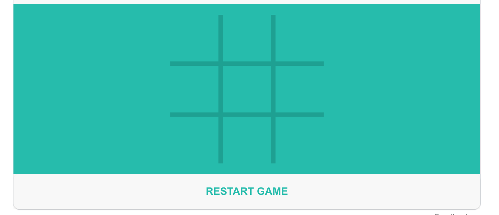

# Tic Tac Toe game

1. **Read the guideline before start**

    - [Guideline](https://github.com/mate-academy/js_task-DOM-guideline)

2. **Result**

   Replace `<your_account>` with your Github username in the links

    - [DEMO LINK](https://andreas-just.github.io/js_tic-tac-toe/)
    - [PULL REQUEST](https://github.com/Andreas-Just/js_tic-tac-toe/pull/1)

___
## Task

**Implement** [Tic Tac Toe game](https://en.wikipedia.org/wiki/Tic-tac-toe)

**Main goal:**

- implement 3x3 field
- player plays against each other
- disable new clicks after game is over until restart

**Stretch goal:**

- play against computer

___
### Screenshot of the game

